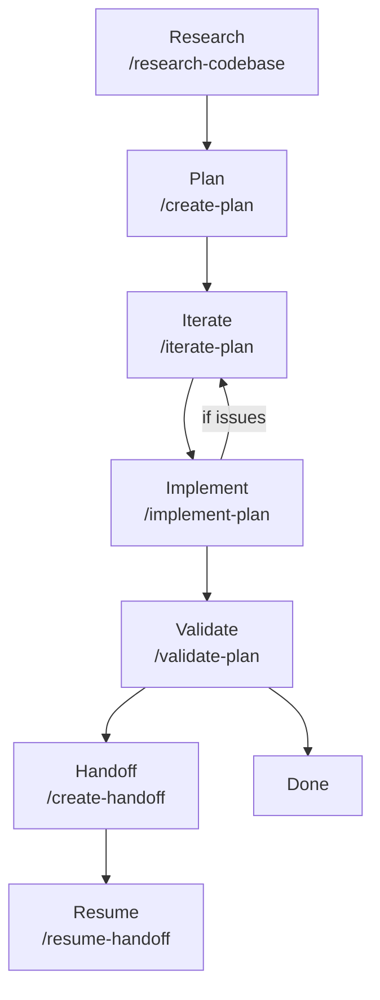

# ACE-Workflows Plugin

A Claude Code plugin implementing ACE-FCA (Agentic Context Engineering - Fresh Context Architecture) principles for structured development workflows. Adapted from HumanLayer's .claude implementation.

## Overview

ACE-Workflows provides a disciplined approach to AI-assisted development through:

- **Research-First Development**: Understand the codebase before making changes
- **Phased Implementation Plans**: Break work into verifiable phases with human gates
- **Intentional Context Compaction**: Preserve knowledge through structured handoffs
- **Human Leverage Points**: Strategic checkpoints for human review and course correction

## Installation

1. Clone or download this plugin to your Claude Code plugins directory
2. Enable the plugin in Claude Code settings
3. The plugin will be available as `ace-workflows` with commands prefixed by `/ace-workflows:`

## Command Reference

### Core Workflow

| Command | Description |
|---------|-------------|
| `/ace-workflows:research-codebase` | Document codebase as-is with thoughts directory for historical context |
| `/ace-workflows:create-plan` | Create detailed implementation plans through interactive research and iteration |
| `/ace-workflows:implement-plan` | Implement technical plans from .harness/shared/plans with verification |
| `/ace-workflows:validate-plan` | Validate implementation against plan, verify success criteria, identify issues |
| `/ace-workflows:iterate-plan` | Iterate on existing implementation plans with thorough research and updates |

### No-Thoughts Variants

For projects without a `.harness/` directory structure:

| Command | Description |
|---------|-------------|
| `/ace-workflows:research-codebase-nt` | Document codebase as-is without evaluation or recommendations |
| `/ace-workflows:create-plan-nt` | Create implementation plans with thorough research (no thoughts directory) |
| `/ace-workflows:iterate-plan-nt` | Iterate on existing implementation plans with thorough research and updates |

### Generic Variants

Simplified versions without project-specific conventions:

| Command | Description |
|---------|-------------|
| `/ace-workflows:research-codebase-generic` | Research codebase comprehensively using parallel sub-agents |
| `/ace-workflows:create-plan-generic` | Create detailed implementation plans with thorough research and iteration |

### Handoffs

| Command | Description |
|---------|-------------|
| `/ace-workflows:create-handoff` | Create handoff document for transferring work to another session |
| `/ace-workflows:resume-handoff` | Resume work from handoff document with context analysis and validation |

### Git & PR

| Command | Description |
|---------|-------------|
| `/ace-workflows:commit` | Create git commits with user approval and no Claude attribution |
| `/ace-workflows:ci-commit` | Create git commits for session changes with clear, atomic messages |
| `/ace-workflows:describe-pr` | Generate comprehensive PR descriptions following repository templates |
| `/ace-workflows:ci-describe-pr` | Generate comprehensive PR descriptions following repository templates |
| `/ace-workflows:describe-pr-nt` | Generate comprehensive PR descriptions following repository templates |

### Debugging

| Command | Description |
|---------|-------------|
| `/ace-workflows:debug` | Debug issues by investigating logs, database state, and git history |

### Linear Integration

| Command | Description |
|---------|-------------|
| `/ace-workflows:linear` | Manage Linear tickets - create, update, comment, and follow workflow patterns |
| `/ace-workflows:ralph-research` | Research highest priority Linear ticket needing investigation |
| `/ace-workflows:ralph-plan` | Create implementation plan for highest priority Linear ticket ready for spec |
| `/ace-workflows:ralph-impl` | Implement highest priority small Linear ticket with worktree setup |
| `/ace-workflows:oneshot` | Research ticket and launch planning session |
| `/ace-workflows:oneshot-plan` | Execute ralph plan and implementation for a ticket |
| `/ace-workflows:founder-mode` | Create Linear ticket and PR for experimental features after implementation |

### Worktree & Review

| Command | Description |
|---------|-------------|
| `/ace-workflows:create-worktree` | Create worktree and launch implementation session for a plan |
| `/ace-workflows:local-review` | Set up worktree for reviewing colleague's branch |

## Workflow Diagram




## .harness/ Directory Structure

The plugin uses a `.harness/` directory to persist knowledge across sessions:

```
.harness/
├── shared/                    # Team-accessible documents
│   ├── research/              # Codebase research findings
│   │   └── YYYY-MM-DD-topic.md
│   ├── plans/                 # Implementation plans
│   │   └── YYYY-MM-DD-feature.md
│   └── handoffs/              # Session handoff documents
│       └── YYYY-MM-DD_HH-MM-SS_description.md
├── [username]/                # Personal notes (optional)
└── global/                    # Cross-repository thoughts (optional)
```

**For projects without a .harness/ directory**, use the `-nt` (no-thoughts) command variants which work with a simpler structure like `research/` and `plans/` directories.

## Agent Descriptions

The plugin uses specialized sub-agents for parallel research:

| Agent | Purpose |
|-------|---------|
| **codebase-locator** | Locates WHERE files live - finds files, directories, and components relevant to a feature. Returns categorized file lists with paths. Does NOT analyze code contents. |
| **codebase-analyzer** | Analyzes HOW code works - traces data flow, implementation details, and technical workings with precise file:line references. A documentarian that explains without suggesting improvements. |
| **codebase-pattern-finder** | Finds SIMILAR implementations - existing patterns, usage examples, and code templates in the codebase. Returns concrete code examples with file:line references. Does NOT evaluate which patterns are better. |
| **thoughts-locator** | Discovers relevant documents in .harness/ directory - finds tickets, research, plans, and handoffs. Returns list of relevant docs with paths. Does NOT analyze document contents deeply. |
| **thoughts-analyzer** | Extracts HIGH-VALUE insights from thought documents - decisions, constraints, rationale, and actionable information. Filters ruthlessly for what matters NOW. Does NOT provide summaries. |
| **web-search-researcher** | EXTERNAL research specialist - finds current APIs, versions, best practices, and documentation from the web. Returns findings with source links and advanced search strategies. |

## ACE-FCA Principles

### 1. Research -> Plan -> Implement

Never jump straight to implementation. The workflow ensures:

1. **Research**: Understand the current state of the codebase
2. **Plan**: Create detailed, phased implementation plans with success criteria
3. **Implement**: Execute systematically with verification at each phase
4. **Validate**: Verify the implementation matches the specification

### 2. Intentional Compaction

Context windows are finite. Instead of letting context accumulate until it becomes unwieldy:

- **Create handoffs** when context is getting large
- **Distill knowledge** into structured documents
- **Resume cleanly** with fresh context and preserved knowledge

Handoff documents capture:
- What was accomplished
- What remains to be done
- Key learnings and gotchas
- Specific file:line references

### 3. Human Leverage Points

Strategic checkpoints where human judgment adds the most value:

- **After research**: Review findings before planning
- **After planning**: Approve plan before implementation
- **Between phases**: Verify phase completion before proceeding
- **After implementation**: Validate before considering complete

These gates prevent runaway automation and ensure alignment with human intent.

## Usage Examples

### Starting a New Feature

```
User: I need to add authentication to my API

Claude: Let me research the codebase first.
/ace-workflows:research-codebase authentication, API security, middleware patterns

[Research complete]

Now let's create an implementation plan.
/ace-workflows:create-plan .harness/shared/research/2025-01-02-authentication.md
```

### Resuming Previous Work

```
User: What were we working on?

Claude: [Session hook detects incomplete work]
I found incomplete work:
- Plan: implement-auth (2/4 phases complete)
- File: .harness/shared/plans/2025-01-02-implement-auth.md

Would you like to resume? I can continue with:
/ace-workflows:implement-plan .harness/shared/plans/2025-01-02-implement-auth.md
```

### Creating a Handoff

```
User: I need to stop for today, but want to continue tomorrow.

Claude: I'll create a handoff document to preserve our progress.
/ace-workflows:create-handoff implement-auth-phase-2

Handoff created! Resume tomorrow with:
/ace-workflows:resume-handoff .harness/shared/handoffs/2025-01-02_17-30-00_implement-auth-phase-2.md
```

## License

MIT
