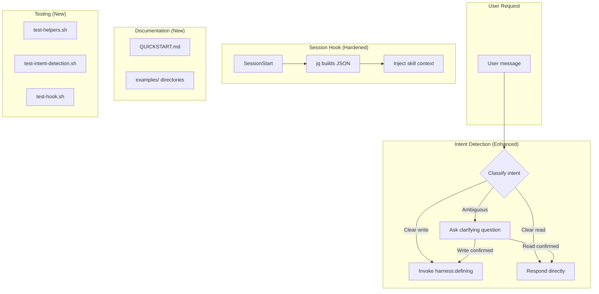
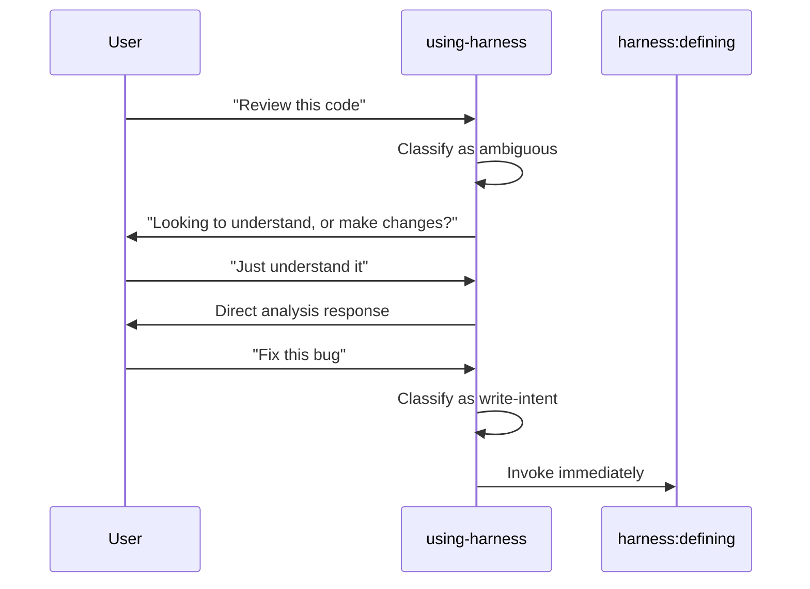
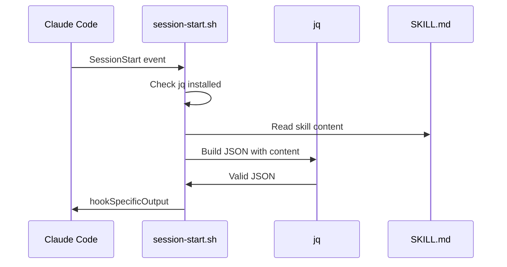

# Design: Harness Plugin Enhancements

## Architecture Overview

This enhancement modifies three distinct areas of the plugin to improve predictability, robustness, and onboarding:



**Key change**: Intent detection transitions from binary (task → defining) to ternary (write → defining, read → direct, ambiguous → clarify).

## Components

### 1. Intent Detection (using-harness/SKILL.md)

Three-tier classification system replacing the current single-action table.

| Category | Behavior |
|----------|----------|
| **Write-intent** | Action verbs indicating code changes. Invoke `harness:defining` immediately. |
| **Read-intent** | Questions or exploration without change intent. Respond directly. |
| **Ambiguous** | Could be either. Ask a brief clarifying question first. |

**Write-intent patterns** (invoke harness:defining):
- Add, Build, Create, Implement
- Fix, Debug, Refactor
- Update, Change, Modify
- Delete, Remove
- Migrate, Optimize
- Write tests for, Set up

**Read-intent patterns** (respond directly):
- "What does X do?"
- "How does X work?"
- Pure greetings
- Meta questions about harness itself
- Explicit skip requests

**Ambiguous patterns** (ask first):
- Review X
- Take a look at X
- Look at X, Check X
- Help me understand X
- Explain X
- Explore X
- Can you help me with X

**Clarification template**:
> "Before I proceed - are you looking to **understand/analyze** this, or do you want to **make changes**?"

### 2. Session Hook (hooks/session-start.sh)

Replace manual character escaping with jq-based JSON construction.

**Current approach** (fragile):
```bash
escape_for_json() {
    # Character-by-character loop
    # Missing edge cases, slow
}
```

**New approach** (robust):
```bash
jq -n --arg context "$skill_content" '{
  hookSpecificOutput: {
    hookEventName: "SessionStart",
    additionalContext: $context
  }
}'
```

**Error handling**:
- Check for jq availability at script start
- Exit with clear error if jq not installed
- Maintain same output format for compatibility

### 3. Documentation

**QUICKSTART.md** (plugin root):
- What harness is (1 sentence)
- Why use it (3 bullets)
- How to start (numbered steps)
- Commands reference (table)
- Link to full WORKFLOW.md

**Example artifacts** (in skills):
- `skills/defining/examples/requirements-example.md`
- `skills/researching/examples/codebase-example.md`
- `skills/researching/examples/research-example.md`
- `skills/planning/examples/plan-example.md`

### 4. Test Harness

Adapt the pattern from `agent-workflow/tests/claude-code/test-helpers.sh`:

**tests/test-helpers.sh**:
- `run_claude()` - Execute Claude Code headlessly
- `assert_contains()` - Pattern matching
- `assert_not_contains()` - Negative pattern matching
- Helper utilities

**tests/test-hook.sh**:
- Execute session-start.sh directly
- Validate JSON output format
- Test with actual SKILL.md content
- Verify jq dependency check

**tests/test-intent-detection.sh**:
- Run Claude with write-intent prompts → verify harness:defining invoked
- Run Claude with read-intent prompts → verify direct response
- Run Claude with ambiguous prompts → verify clarification asked

## Data Flow

### Intent Detection Flow



### Hook Flow



## Key Decisions

| Decision | Rationale |
|----------|-----------|
| jq as required dependency | User approved; jq is ubiquitous; manual escaping is too fragile |
| Ask on ambiguous rather than default to workflow | Reduces friction; clarification is one exchange vs wrong-path recovery |
| Examples in skill directories, not centralized | Keeps examples close to the skills they demonstrate |
| Adapt test-helpers.sh pattern | Proven approach in same repo; consistent with ecosystem |
| Clarification is brief, binary question | Minimize friction while ensuring correct routing |
